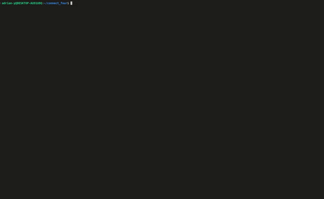

# CLI Connect Four Game

**To play the game visit [replit](https://replit.com/@adrian-y1/ConnectFour) and run `ruby lib/main.rb` inside the terminal.**

This is a two-player command-line interface Connect Four game created with the Ruby language. This project was part of [The Odin Project's Ruby course.](https://www.theodinproject.com/lessons/ruby-connect-four)

 
*A quick GIF demonstration of a diagonal Connect Four win*

## Overview
This CLI Connect Four game was created with Ruby 3.1 and is a two-player strategy game where players take turns dropping their game pieces into one of seven columns on the game board. The objective of the game is to connect four of one's own pieces in a horizontal, vertical, or diagonal line while also preventing the opponent from doing the same.

Players enter commands in the CLI to perform the actions required to play the game including; selecting a column to drop a piece and entering their names. The game has been implemented with various features such as checking for valid moves, detecting a win or draw, and displaying the current game board after each turn.

Rspec 3.11 has been used to create tests for the game, with a focus on testing critical class methods to ensure the game is running smoothly and properly.

## How To Play
- Online
  - To play online visit the link at the top of this document or click [here](https://replit.com/@adrian-y1/ConnectFour)
  - Press `Run` and then enter `ruby lib/main.rb` inside the teminal to begin the game.
- Local
  - To play locally, you must first install [Ruby](https://www.ruby-lang.org/en/)
  - After that, [clone](https://github.com/git-guides/git-clone) this [repository](https://github.com/adrian-y1/TOPConnectFour)
  - Install the [colorize](https://github.com/fazibear/colorize) gem
  - To start the game, enter `ruby lib/main.rb` in the terminal
  - To run the tests you must first install [Rspec](https://rspec.info/)
  - After that, enter `rspec spec/` to execute all the tests
    - Alternatively you can enter `rspec spec/path/to/file` to execute tests for a specific file or folder

## Features
- Two-player game
- Color-coded discs for each player
- Interactive gameplay through command-line interface
- Vertical, horizontal, and diagonal win conditions
- Error handling for invalid inputs or moves
- Display of the game board after each turn
- Class method tests using `Rspec`

## Difficulties 
 During the implementation of this project, I faced a significant challenge while figuring out the logic for the diagonal win. It was particularly challenging because diagonal check required checking four different scenarios: bottom-left to top-right, bottom-right to top-left, top-left to bottom-right, and top-right to bottom-left. Initially, it was difficult to wrap my head around how it would work.

## Overcoming Difficulties
When I faced the challenge of implementing the diagonal win check condition in this project, I approached it with careful planning and a systematic approach. I started by drawing out each possible diagonal scenario on paper to visualize the logic needed for each case. Hardcoding the scenarios initially helped to solidify my understanding of what was required to solve the problem. Additionally, I sought assistance from the supportive community on [The Odin Project's discord](https://discord.gg/V75WSQG), which provided helpful insights and guidance to help me overcome this problem.

## Conclusion
Creating this project was a rewarding experience that helped me improve my skills in structuring code and utilizing dependency injections for easier testing. Not only did it allow me to develop a functional Connect Four CLI game, but it also gave me a deeper understanding of the concepts and techniques used in software development to develop such projects. And it was extremely fun.